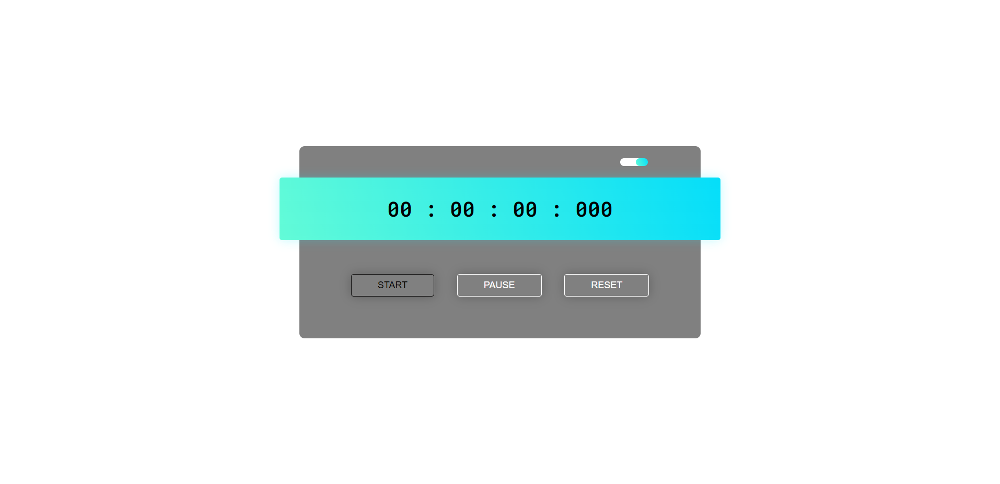
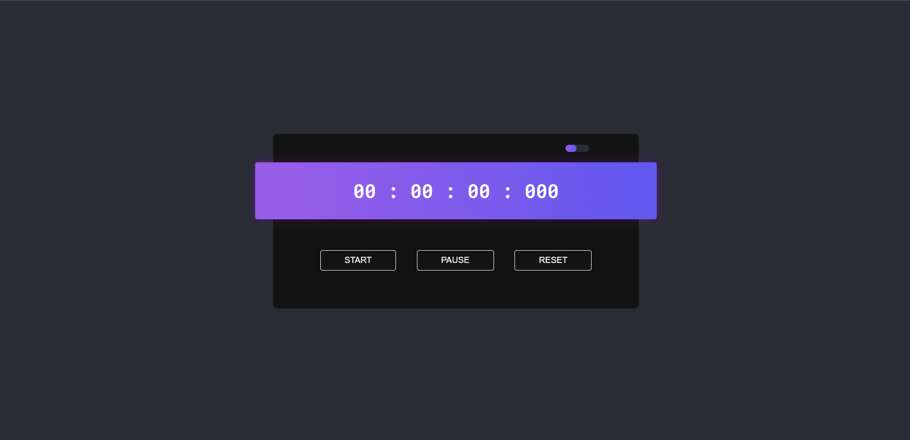

<h1><a href="https://lnkd.in/d5jK-aau" target="_blank">Stop Watch⌚</a></h1>

> Status: Terminado ✅

### Essa aplicação foi feita com intuito de estudo de JavaScrip aprofundado

## Além do desafio, eu implementei algumas
+ Estilização dos botões pelo CSS
+ Botão Dark and White theme 
+ Javascript para troca de temas
+ Favicon adicionado

## Funcionalidades que estão em desenvolvimento: 
+ Já está completo! 🆗

## Tecnologias Usadas:

+ HTML5 🔶
+ CSS3 🔷
+ JavaScript 🟨
+ Git/Github 🐈‍⬛

## Algumas Imagens

#
